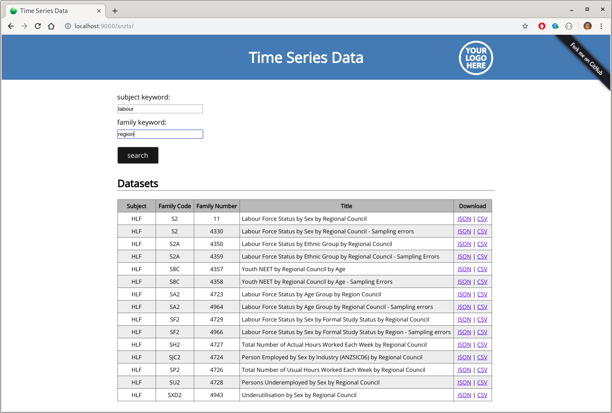
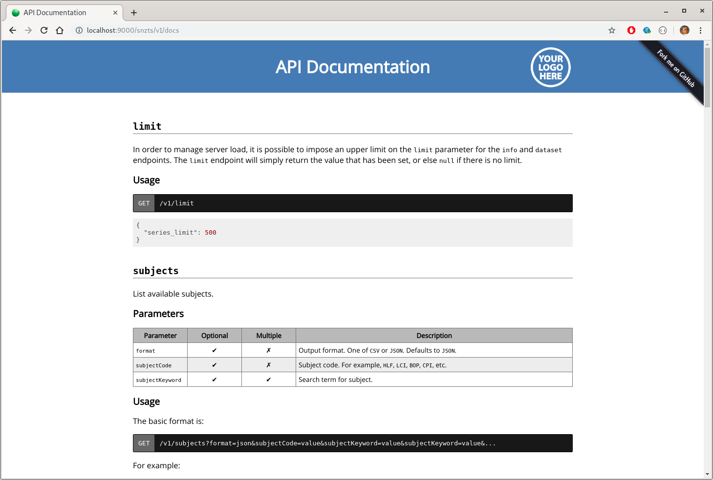
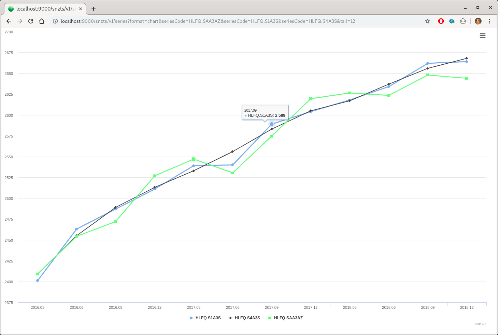
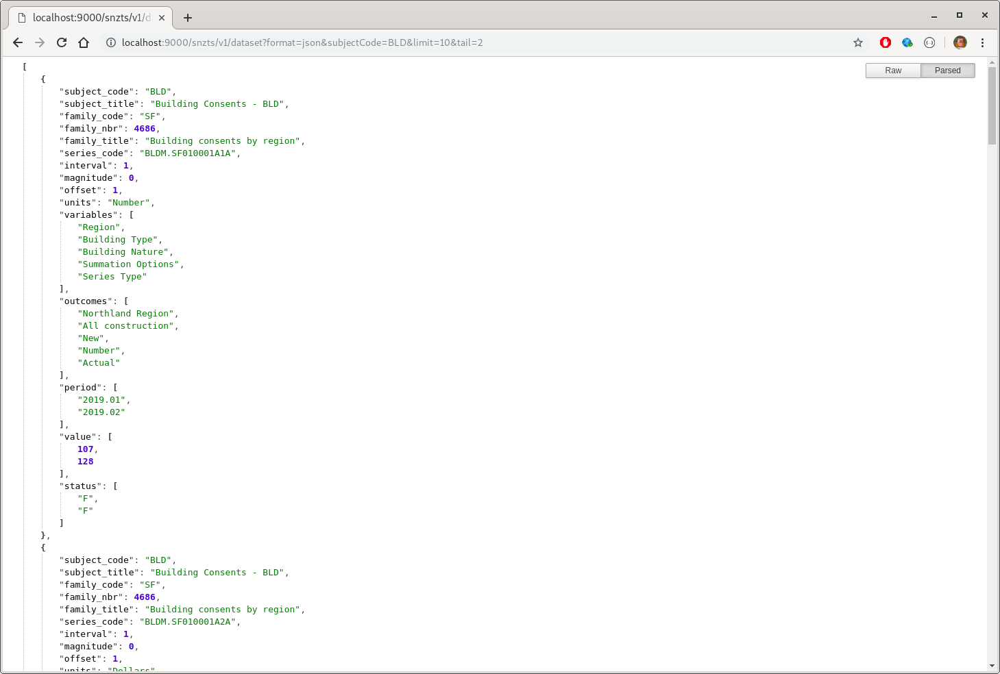

# Data Service for Public Stats NZ Time Series Data

This repository contains:

* `snzts` - source code for a time series data service
* `snzscrape` - a simple command-line utility for scraping the [Stats NZ website](https://www.stats.govt.nz/large-datasets/csv-files-for-download/)
* `docker` - Dockerfiles for easy running and deployment of the service
* `client` - prototype client libraries--just an R package for now

**Note: I work for Stats NZ, and it would not have been possible to reshape the data without arranging for the release of some internally-held metadata.  However, this is _not_ a Stats NZ product.**

# Quick Start

By far and away the easiest way to get everything up and running is to use the provided Docker Compose setup.  First, the `snzscrape` and `snzts` projects need to be built.  These are sbt projects, so sbt needs to be available.  If you don't have sbt already, it will suffice just to fetch a copy and unpack it in the source repository root:

```bash
curl -sL https://github.com/sbt/sbt/releases/download/v1.5.5/sbt-1.5.5.tgz | tar xzvf - 
```

Build `snzcrape` by issuing:

```bash
cd snzscrape && ../sbt/bin/sbt assembly && cd ..
```

Build `snzts` by issuing: 

```bash
cd snzts && ../sbt/bin/sbt dist && cd ..
```

The containers are configured to run as the current user, and to ensure this works correctly, the following environment variables need to be set:

```bash
export UID=$(id -u)
export GID=$(id -g)
```

The compose setup also makes use of a couple of other environment variables&ndash;`PG_PASS` to set an admin password for the PostgreSQL back-end, and `APPLICATION_SECRET` for the front-end.  The `APPLICATION_SECRET` needs a particular format, and can be created manually as follows:

```bash
export APPLICATION_SECRET="$(head -c 32 /dev/urandom | base64)"
```

The easiest option is probably just to create a file called `.env` in the root directory with the required variables (and make sure to set the mode to 600):

```bash
echo "GID=$(id -g)" > .env
echo "UID=$(id -u)" >> .env
echo "APPLICATION_SECRET=\"$(head -c 32 /dev/urandom | base64)\"" >> .env
echo "PG_PASS=\"$(head -c 8 /dev/urandom | base64)\"" >> .env
chmod 600 .env
```

Then, we need to scrape the Stats NZ website so data is available to load into our back-end.  To do this, run:

```bash
docker-compose -f snzscrape.yml up -d
```

Once all prerequisites are satisfied, a local copy of the service can be started by running:

```bash
docker-compose -f snzts.yml up -d
```

The service will then be accessible at `localhost:9000/snzts`.  









We can stop the service at any time by running:

```bash
docker-compose -f snzts.yml down
```

If you want to test this with Nginx, a basic location directive which will work is as follows (not sure about the CORS thing):

```plaintext
server {

  ...

  location /snzts/ {
    proxy_pass http://127.0.0.1:9000/snzts/;
    proxy_http_version 1.1;
    proxy_set_header Upgrade $http_upgrade;
    proxy_set_header Connection "upgrade";
    if ($request_method = 'GET') {
      add_header 'Access-Control-Allow-Origin' '*';
    }
  }

  ...

}

```

# PostGraphile and PostgREST

Note that the backend database can also be used as the basis for a data service using tools such as [PostGraphile](https://www.graphile.org/postgraphile/) and [PostgREST](https://postgrest.org/en/stable/).  I have created a separate post about that [here](https://cmhh.github.io/2021/2021-08-14-data-services-from-postgres/).  `Dockerfile`s have been provided to demonstrate this, and they can be run at the same time as the `sntzs` service by running:

```bash
docker-compose -f allservice.yml up -d
```

To create nice end-points using NGINX for PostGraphile, add something like the following to your config:

```plaintext
server {

  ...

  location /snztsgql/ {
    proxy_pass http://127.0.0.1:5000/snztsgql/;
    proxy_http_version 1.1;
    proxy_set_header Upgrade $http_upgrade;
    proxy_set_header Connection "upgrade";
  }

  ...
}
```

Similarly, to create end-points (you'll still need to do more work to update the OpenAPI description for use with Swagger, etc.) for PostgREST:

```plaintext
stream {

  ...

  http {

    ...

    upstream postgrest {
      server localhost:3000;
      keepalive 64;
    }

    ...
  }

  ...
}

server {

  ...

  location /snztsrest/ {
    default_type application/json;
    proxy_hide_header Content-Locatoin;
    add_header Content-Location /snztsrest/$upstream_http_content_location;
    proxy_set_header Connection "";
    proxy_http_version 1.1;
    proxy_pass http://postgrest/;
  }

  ...
}
```
