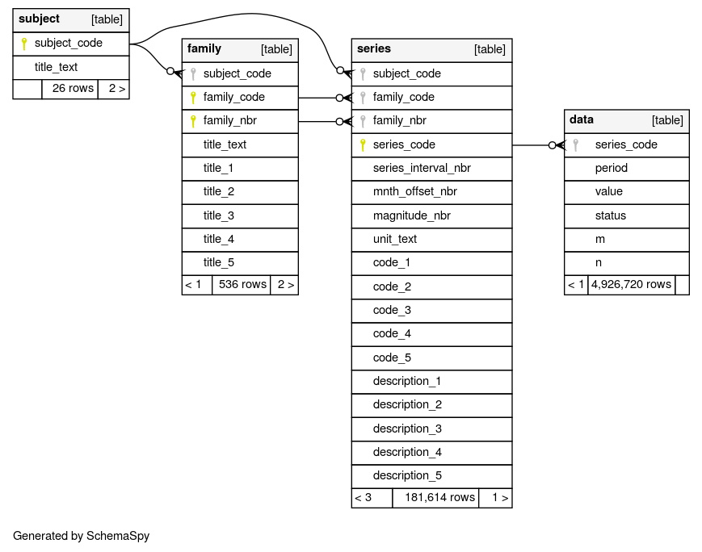
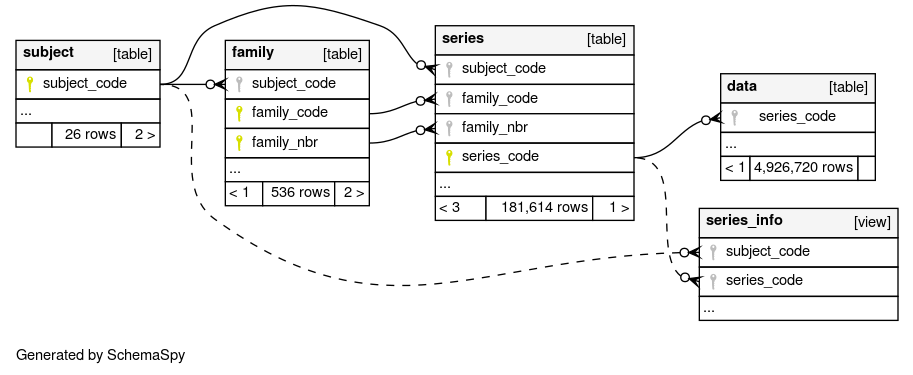

# Data Service for Public Stats NZ Time Series Data

This repository contains a basic data service for time series data sourced from the [Stats NZ website](https://www.stats.govt.nz/large-datasets/csv-files-for-download/).  You will need [`sbt`](https://www.scala-sbt.org/) to build the project.  To build it, simply run:

```
sbt dist
```

This will yield a file called:

```
target/universal/snzts-0.3.0.zip
```

This archive can be unzipped on any machine with a Java runtime, and the service started by running the `bin/snzts` script (or `snzts.bat` on Windows).  Alternatively, the service can be run in development mode via:

```bash
sbt run
```

The service also needs a companion database to be running with the appropriate schema.  The database connection is configured in [`conf/application.conf`](conf/application.conf), and the defaults are:

```as.is
slick.dbs.default.profile = "slick.jdbc.PostgresProfile$"
slick.dbs.default.driver = "slick.driver.PostgresqlDriver$"
slick.dbs.default.db.driver = "org.postgresql.Driver"
slick.dbs.default.db.url = "jdbc:postgresql://backend:5432/snzts"
slick.dbs.default.db.user = "webuser"
slick.dbs.default.db.password = "webuser"
slick.dbs.default.db.numThreads = 8
slick.dbs.default.db.maxConnections = 8
```

For example, a public database is available (with no guarantee of uptime given), and can be used by modifying the line:

```as.is
slick.dbs.default.db.url = "jdbc:postgresql://backend:5432/snzts"
```

to read:

```as.is
slick.dbs.default.db.url = "jdbc:postgresql://cmhh.hopto.org:5432/snzts"
```

To easily run a local copy of the database, a Docker container is provided in `docker/backend` for this purpose.  It can be built and run from root folder as follows:

```bash
docker build -t snzts-backend -f docker/backend/Dockerfile .
docker run -d --rm --name backend -p 5432:5432 snzts-backend
```

If one _really_ wants to build a database from scratch, the schema looks as follows:



In addition, a single table view is defined as follows:

```sql
CREATE 
  MATERIALIZED VIEW series_info 
AS  
SELECT 
  a.subject_code, b.family_code, b.family_nbr, c.series_code, 
  a.title_text as subject_title,
  b.title_text as family_title,
  b.title_1, b.title_2, b.title_3, b.title_4, b.title_5,
  c.series_interval_nbr, c.mnth_offset_nbr, c.magnitude_nbr, c.unit_text, 
  c.code_1, c.code_2, c.code_3, c.code_4, c.code_5, 
  c.description_1, c.description_2, c.description_3, c.description_4, c.description_5
FROM
  subject a
INNER JOIN
  family b
ON
  a.subject_code = b.subject_code
INNER JOIN
  series c
ON
  a.subject_code = c.subject_code
  and b.family_code = c.family_code
  and b.family_nbr = c.family_nbr
order by
  a.subject_code,
  b.family_code, b.family_nbr,
  c.series_code
WITH NO DATA
```

The implied relations including the table view are as follows:


